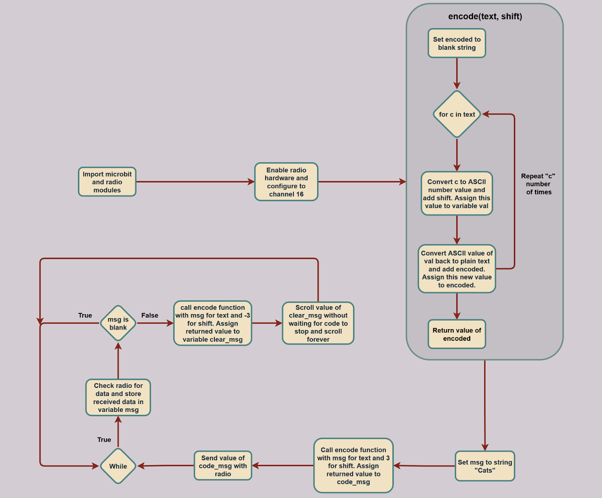

# Microbit_Encoded_Radio
Lesson 13 of my Intro to Python course with Microbit

Program Overview: This program is an encoded radio messenger. It sends encrypted strings with the inbuilt radio on the microbit and also receives encrypted strings and decrypts them. It then displays the message on the screen. 

New Learnings: A new learning from this lesson is involving some built-in python string character encoding functions. The ord() function translates the passed in string’s characters to ASCII number values. Then, the chr() function does the opposite of ord(), it translates passed in ASCII values back into normal strings. In the context of this program, this means that the ord() function translates the message into ASCII number values. Then a shift is added to these values, and the chr() translates these shifted values back into strings. The resultant is a seemingly gibberish string, that has a hidden pattern. The receiving end then does the opposite of the encoding, it translates the gibberish string to ASCII then shifts the opposite way, and translates it back into a string, which results in the original message. Another new learning was regarding a new type of loop called a for loop, which can repeatedly execute a code block for a set amount of times For loops are usually used in conjunction with iterable items like strings, ranges, or lists. In this program, for example, a for loop is used inside the encode function to encode each character in a string sequentially. The loop goes through the string as many times as there are characters in the string, and when it’s finished the resulting string is an ASCII encoded value.

Connections With Previous Lessons: One connection with a previous lesson is regarding the radio module. In the previous lesson, it was used in a very barebones and basic way to make a simple program where it just sent a number. Although in this lesson, there is an added layer of complexity with sending and receiving encoded strings. This program helps cement basic concepts regarding the radio module and showcase its potential. 

Real-World Connections: One real-world connection made with this program is messaging applications. Billions of text messages are sent every day and they can often contain valuable private information. If a person with malicious intent were to get ahold of this information, there could be devastating consequences. This is why a good messaging application must not only be able to send and receive messages reliably but also be able to encrypt and decrypt messages securely. This python program is a very primitive iteration of a traditional messaging application and it shows the process that messaging applications may use.

Applications: One application for this program is making a brute force decrypter. This program would take in an already encrypted string, and run commonly used decryption algorithms to try and decode it. Like in the Cyber Bit program, this could take the ASCII values and brute force the decryption by trying every possible shift value. Since computers can do things much faster than humans, there’s a possibility that the decryption could be cracked in seconds. Although it doesn’t just have to be this method, there are many other commonly used encryption methods out there to apply.

